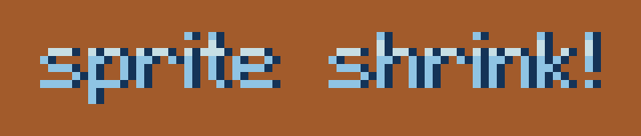

# Sprite Shrink

Don't let the name fool you! This is an Aseprite extension that allows you to quickly stage a single cel of an animation to be shrunk or grown across a number of frames. Currently there are two animation modes available: `Linear` and `Cubic`!

## How to Use Sprite Shrink

1. Download this extension by visiting the releases page!
2. In Aseprite, simply install this extension (only have to do this once) and navigate to `Sprite > Animate Sprite Shrink / Grow`. Clicking this option will open a dialog box.

## Things to Know

* The animated cel will be the cel that is currently selected when the menu option is clicked. _ALL PIXEL INFORMATION within that cel_ will be animated, so be sure to use layers wisely (i.e., put images that you don't want shrunk / grown on different layers)
* Select the frame you'd like the animation to start on
* Select how long the animation should last (in frames)
* Select whether you'd like the sprite to grow or shrink
* Select whether to use `Linear` animation or `Cubic` animation
    * Linear: a constant rate of change across all of the frames
    * Cubic: a variable rate of change across all of the frames (the script will attempt to slowly start and slowly end the animation, while being fast in the middle)
* Depending on the options you selected above, you may receive two different windows:
    * If you selected `Linear`, you will be asked how much bigger or smaller the sprite should get with each next frame. For example, if you have an 8x8 sprite and you type in 2, the first frame would be 8x8, next 10x10, then 12x12, etc.
    * If you selected `Cubic`, you will be asked the target _sprite width_ that the animation should end on. For example, if you had an 8x8 sprite and you wanted it to become 128x128, you'd type in 128 (remember this is the width, not the height, of the sprite).

## Other Notes

* The script uses `RotSprite` as the scaling method behind the scenes.
* The script will always scale with the pivot at the center of the sprite.
* The script will always create new frames, pushing back existing ones. For example, if frames 1-15 already exist, and you start a new animation using this script on frame 12, former frames 12-15 will be pushed back to the end of the animation, and the first frame of the animation will be on frame 12.

## Credits

This extension was commissioned by [@pixelocrat](https://twitter.com/pixelocrat) on Twitter.

As an advocate of open-source software, feel free to suggest edits, or just fork this repository and make your own! The license on this software is open for commercial and private use. This extension will remain free forever; however, if you'd like to buy me a coffee, you can do so here: 

